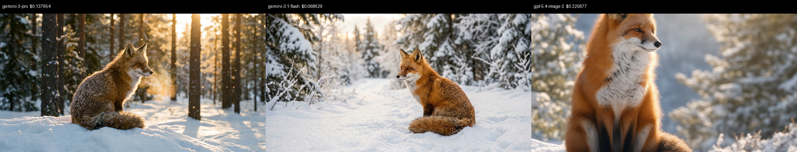
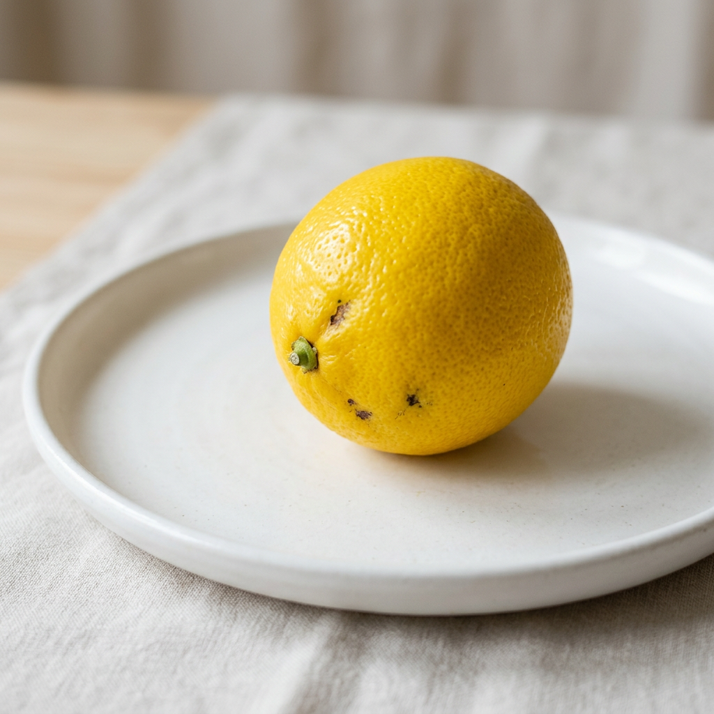
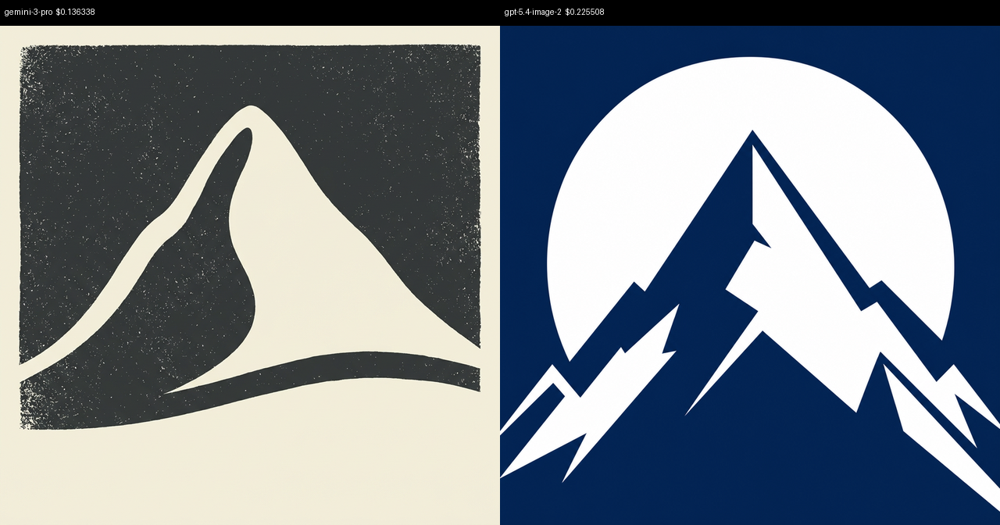
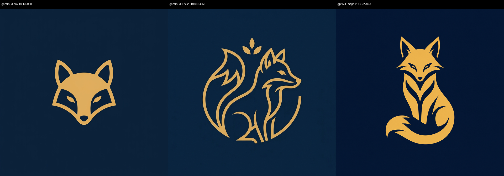

# model-montage - example output

A real run of `skills/model-montage/generate.py` (the same script the skill invokes) across a
few representative cases. Each comparison montage is labeled with the model and its cost, so a
single image shows every model's take side by side. Total spend for this run was roughly
**$1.30** across 9 successful model calls.

## Feature checklist

| # | Feature | Case | Result |
|---|---------|------|--------|
| 1 | 3 models in parallel | C1 | all 3 returned |
| 2 | Exact resolution (crop-to-fill) | C1-C4 | every file matches requested WxH exactly |
| 3 | Labeled comparison montage (2+ models) | C1, C3, C4 | built and labeled |
| 4 | Single model -> montage skipped | C2 | no montage |
| 5 | Model subset selection (`--models`) | C2 (1), C3 (2) | runs only chosen models |
| 6 | Per-model and total cost reporting | C1-C4 | printed per model plus total |
| 7 | Design doc applied to every model (`--design`) | C4 | all 3 followed the navy/gold flat-vector spec |
| 8 | Missing design doc error | E1 | clear error, no API call |
| 9 | Unknown model error | E2 | lists valid choices |
| 10 | Missing API key error | E3 | clear guidance |

---

## C1 - All 3 models, no design

- **Prompt:** `a red fox sitting in fresh snow, cinematic lighting`
- **Resolution:** `1200x630` · **Models:** all 3 · **Design doc:** none
- **Total cost:** `$0.43246`



| Model | Cost |
|-------|------|
| gemini-3-pro | $0.137954 |
| gemini-3.1-flash | $0.068629 |
| gpt-5.4-image-2 | $0.225877 |

---

## C2 - Single model, no montage

- **Prompt:** `a single ripe lemon on a white plate, soft studio light`
- **Resolution:** `1024x1024` · **Models:** `gemini-3.1-flash` · **Design doc:** none
- **Montage:** `(skipped)` - only one model · **Total cost:** `$0.067228`



---

## C3 - Two models, 2-panel montage

- **Prompt:** `a minimalist mountain peak emblem, two-tone`
- **Resolution:** `800x800` · **Models:** `gemini-3-pro, gpt-5.4-image-2` · **Design doc:** none
- **Total cost:** `$0.361846`



| Model | Cost |
|-------|------|
| gemini-3-pro | $0.136338 |
| gpt-5.4-image-2 | $0.225508 |

---

## C4 - All 3 models, WITH design doc

The design doc forces a specific look and every model obeys it. Compare against C1 (no design).

**`design.md` used:**

```markdown
# Brand design guidelines
- Palette: deep navy (#0B1F3A) background with warm gold (#E5B567) accents only.
- Style: flat minimalist vector illustration. No photorealism, no gradients.
- Composition: single centered subject, generous negative space.
- Mood: premium, calm, modern.
```

- **Prompt:** `a fox mascot logo`
- **Resolution:** `1024x1024` · **Models:** all 3 · **Design doc:** `design.md`
- **Total cost:** `$0.43544`

Note how all three share the navy background and gold flat-vector treatment:



| Model | Cost |
|-------|------|
| gemini-3-pro | $0.139088 |
| gemini-3.1-flash | $0.0684055 |
| gpt-5.4-image-2 | $0.227944 |

---

## Error cases (no API spend)

| Case | Command (abridged) | Output |
|------|--------------------|--------|
| E1 - missing design doc | `--design ./nope.md` | `Design doc not found: <path>/nope.md` |
| E2 - unknown model | `--models bogus` | `Unknown model 'bogus'. Choose from: gemini-3-pro, gemini-3.1-flash, gpt-5.4-image-2 (or the long ids ...)` |
| E3 - no API key | env without `OPENROUTER_API_KEY` | `No OpenRouter API key found. Set $OPENROUTER_API_KEY, write the key to ~/.config/openrouter/key, or pass --api-key.` |

---

## Dimension audit

Every individual image matches its requested resolution exactly; montages are
`(panels x 640) wide x (scaled height + 32px label strip)`.

```
1200x630  per-model images (C1)        OK
1024x1024 gemini-3.1-flash image (C2)  OK
800x800   per-model images (C3)        OK
1024x1024 per-model images (C4)        OK
1920x368  compare_1200x630 (3 panels)  OK
1280x672  compare_800x800  (2 panels)  OK
1920x672  compare_1024x1024 (3 panels) OK
```
